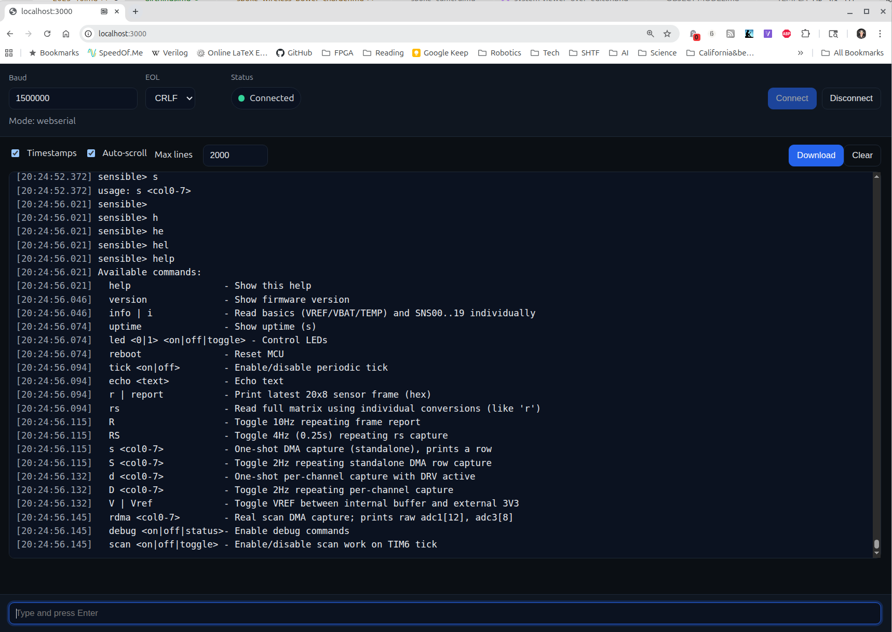

# Web Serial Console (Next.js + Preact)



A minimal, dark-mode, client-only console for Web Serial and Web MIDI. Built with Next.js (Pages Router) and Preact via `preact/compat`. Designed for static export and deployment to GitHub Pages.

## Features

- **Console**: scrolling output, configurable capped buffer (default 2000 lines), timestamps toggle, auto-scroll toggle, clear, download log
- **Input**: single-line input, send on Enter (configurable EOL: LF/CR/CRLF)
- **Connection**: pick a serial device, set baud rate, connect/disconnect
- **Status**: connection status badge and error surfacing
- **Errors**: structured error messages (including disconnect reasons) appended to the console
- **Persistence**: remembers baud, EOL, timestamps, auto-scroll, and max lines in `localStorage`
- **Fallback**: Mock transport when Web Serial is unavailable (for demo/testing)
- **MIDI Console**: connect via Web MIDI, select an input, start/stop streaming, view incoming SysEx frames as hex, and see outgoing TX entries
- **MIDI Status**: device list, connection state, and error surfacing (e.g., no inputs, only virtual “MIDI Through”, or no selection)
- **MIDI Persistence**: remembers timestamps, auto-scroll, max lines, and the selected input in `localStorage`

## Tech Stack

- **Next.js** (Pages Router), JavaScript-only
- **Preact** via alias: `react` and `react-dom` → `preact/compat`
- **Plain CSS** with CSS variables for a minimal modern dark theme
- **Static export** for GitHub Pages (`next export`)

## Architecture

- `pages/index.js` — client-only app composition (ConnectionPanel + Console + InputBar)
- `components/ConnectionPanel.js` — baud, EOL, connect/disconnect, status, errors
- `components/Console.js` — output area + toolbar (timestamps, auto-scroll, max lines control, clear, download)
- `components/InputBar.js` — text input, Enter to send
- `components/MidiConnectionPanel.js` — MIDI input select, status, connect/disconnect, start/stop streaming
- `lib/serial/SerialClient.js` — framework-agnostic facade that emits events and wraps transports
- `lib/serial/WebSerialTransport.js` — Web Serial implementation
- `lib/serial/MockTransport.js` — mock implementation (echo + periodic messages)
- `lib/serial/LineCodec.js` — robust EOL splitting/buffering (splits on CRLF, LF, or CR)
- `lib/serial/constants.js` — defaults: `DEFAULT_BAUD=115200`, `DEFAULT_EOL='\n'`, `EOL_OPTIONS`
- `lib/serial/utils.js` — helpers (support check, emitter, timestamp formatting)
- `lib/midi/MidiClient.js` — framework-agnostic Web MIDI facade; emits `status`, `devices`, `sysex`, `tx`, `error`
- `lib/midi/utils.js` — Web MIDI support checks
- `styles/globals.css` — dark theme and minimal control styling
- `next.config.js` — Preact alias, static export, dynamic `basePath`/`assetPrefix`
- `.github/workflows/deploy.yml` — GitHub Pages deployment workflow

### Serial core design

`createSerialClient(opts)` returns an object with:
- `connect({ baudRate })`, `disconnect()`
- `write(text)`, `writeLine(text)` — appends configured EOL for `writeLine`
- `setSettings(patch)` — e.g. `{ eol: '\n' | '\r' | '\r\n' }`
- `getSettings()`, `getStatus()`, `getMode()`
- `on(type, handler)`, `off(type, handler)` — events: `status`, `line`, `error`, `settings`

Internals:
- Transport is chosen at runtime: `webserial` if `navigator.serial` exists, otherwise `mock`
- `WebSerialTransport` follows the canonical pattern: single reader/writer, one read loop, flush+release on close; emits structured errors with `{ where, lost, name, message, stack, raw }` and surfaces `navigator.serial` disconnects
- `SerialClient` flushes any buffered partial line on disconnect and passes structured errors to the UI
- `LineCodec` buffers raw chunks → splits into lines by EOL; incoming split is tolerant of CRLF/LF/CR regardless of the selected outgoing EOL

### MIDI core design

`createMidiClient()` returns an object with:
- `connect()`, `disconnect()` — requests Web MIDI access with SysEx enabled and manages device state
- `selectInput(id)` — chooses the MIDI input to listen to; output is auto-selected to match the input name when possible
- `getStatus()`, `getSelectedInputId()`, `getDevices()` — current state and available inputs/outputs
- `sendCC(controller, value, channel)` — convenience for Control Change
- `sendSysex(type, payload)` — sends a device-specific SysEx frame
- `startStreaming()`, `stopStreaming()` — send SysEx commands to enable/disable streaming on the device
- `on(type, handler)`, `off(type, handler)` — events: `status`, `devices`, `sysex` (incoming bytes), `tx` (outgoing), `error`

The UI renders incoming SysEx as uppercase hex and logs outgoing transmissions as `TX ...` lines. Settings for the MIDI console (timestamps, auto-scroll, max lines, selected input) are persisted to `localStorage`.

#### SysEx frame structure (generic)

This project treats SysEx frames generically. A typical frame layout is:

```
F0 <manufacturer/vendor identifier> <product/model or group fields> <payload length> <message type> <payload bytes...> F7
```

- The exact field meanings and lengths are device-specific.
- The app only displays the raw bytes and does not parse payloads beyond framing.

## Using the Web MIDI console

1. **Connect**: In the MIDI panel, click Connect to grant Web MIDI access (with SysEx).
2. **Select input**: Choose a physical input device. If only a virtual "MIDI Through" is present, the panel will indicate no physical device.
3. **Start streaming**: Click Start Streaming to send a SysEx command that enables device streaming. Use Stop Streaming to disable it.
4. **Observe and log**: Incoming SysEx appears as hex lines; outgoing messages are logged as `TX ...`. Use the toolbar to toggle timestamps, auto-scroll, adjust max lines, clear, or download the log (`webmidi-sysex.log`).

## Prerequisites

- Node.js >= 18.17 (recommended: Node 20 LTS)
  - Preact/Next integration and Next 14 require modern Node. If you see an engine warning, upgrade Node.
- A Chromium-based browser (Chrome, Edge) over HTTPS for Web Serial access

Using `nvm` to install and use Node 20:
```bash
nvm install 20
nvm use 20
node -v
```

## Install

```bash
npm install
```

## Run (development)

```bash
npm run dev
# open http://localhost:3000/
```

## Build static export

```bash
npm run build:static
# output in ./out
```

Quickly preview the export locally:
```bash
npx serve out
```

## Deploy to GitHub Pages

This repo includes a GitHub Actions workflow: `.github/workflows/deploy.yml`.

- On push to `main`, it will build and export the site, then publish `out/` to GitHub Pages.
- Ensure repo Settings → Pages → Build and deployment → Source = GitHub Actions.
- Site URL (project page): `https://<username>.github.io/web-interface/`

### Base path

Static export is configured with dynamic `basePath`/`assetPrefix` in `next.config.js`:
- Dev: no base path, runs at `/`
- Production: `basePath='/web-interface'`, `assetPrefix='/web-interface/'`
If you rename the repo, update `repoBase` accordingly.

## Browser Support and Permissions

- Web Serial is supported on Chromium-based browsers. It requires HTTPS and a user gesture to request a port.
- Web MIDI is supported on Chromium-based browsers. It requires HTTPS and the MIDI permission with SysEx enabled; the app requests access with `sysex: true`.
- If Web Serial is unsupported, the app switches to Mock mode and continues to function for demo/testing.
- Disconnects are detected and surfaced to the UI with a status update and error message.

## Tested

It works very well on the following:

- Linux Chrome
- Windows Chrome
- Windows Firefox
- Windows Edge

Known limitations:

- Linux Firefox — does not work without an add-on enabling Web Serial
- macOS — untested

## Troubleshooting

- "Unsupported engine" or Next.js failing to run: upgrade Node to >= 18.17 (prefer Node 20) via `nvm install 20 && nvm use 20`.
- No devices shown / prompt doesn’t appear: Make sure you’re in a supported browser and served over HTTPS (or `localhost` during dev).
- Empty output: Verify baud rate matches your device and that EOL matches your device’s line endings when sending.
- Error `NetworkError: The device has been lost.`: indicates an OS/USB-level detach or device reset right after open. Check cable/power and ensure no other process has the port open.

## License

MIT
